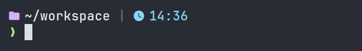
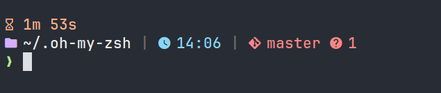

cat << 'EOF' > README.md
# 🌈 Bright Catppuccin ZSH Theme

> A vibrant, modern ZSH prompt built on the beautiful Catppuccin Mocha palette with bright color vibes

---

## ✨ Features

- 🔁 **Multi-line prompt** with clean separation of information  
- 🌈 **Bright Catppuccin Mocha palette**  
- 🌿 **Git status** with branch, changes, upstream, and more  
- 🐍 **Python virtual environment** and conda env detection  
- ⏱️ **Command execution time** display for long-running commands  
- 🧠 **Smart path truncation**  
- 🧑‍💻 Optional **user@host** display (configurable)  
- 🧰 Background jobs and exit status indicators  
- ⚡ **Fast**, written in native Zsh  

---

## 📸 Screenshots

### Default Prompt



### Git Integration



---

## 📦 Installation

### 1. Clone the Repo

```bash
git clone https://github.com/yourusername/bright-catppuccin-zsh-theme.git
```

### 2. Move Theme to Oh My Zsh Custom Themes Directory

```bash
mv bright-catppuccin-zsh-theme/bright-catppuccin.zsh-theme ~/.oh-my-zsh/custom/themes/
```

> 📝 Rename the theme file to \`bright-catppuccin.zsh-theme\` if needed.

Alternatively, symlink the theme:

```bash
ln -s "\$PWD/bright-catppuccin-zsh-theme/bright-catppuccin.zsh-theme" ~/.oh-my-zsh/custom/themes/bright-catppuccin.zsh-theme
```

### 3. Set the Theme in \`.zshrc\`

Open your ZSH configuration:

```bash
nano ~/.zshrc
```

Find the line:

```bash
ZSH_THEME="..."
```

Replace it with:

```bash
ZSH_THEME="bright-catppuccin"
```

> ⚠️ Do **not** include \`.zsh-theme\` in the name — Oh My Zsh handles that automatically.

### 4. Apply the Changes

```bash
source ~/.zshrc
```

Your prompt should now be glowing with Catppuccin brightness! 🌈

---

## ⚙️ Optional Configuration

You can enable or disable features by setting variables in your \`.zshrc\` **before** loading the theme.

### Show \`user@host\`

```bash
export BRIGHT_CATPPUCCIN_SHOW_HOST=true
```

### (More options coming soon!)

---

## 🧪 Requirements

- Zsh 5.0+  
- [Oh My Zsh](https://ohmyz.sh/) or compatible framework  
- Terminal with **24-bit truecolor** support (e.g., iTerm2, Kitty, Alacritty, Windows Terminal)

---

## 🧊 Recommended Fonts

Use a [Nerd Font](https://www.nerdfonts.com/font-downloads) for best icon support.  
We recommend **FiraCode Nerd Font**, **JetBrains Mono Nerd Font**, or **MesloLGS NF** (Oh My Zsh default).

---

## 📜 License

MIT — free to use, modify, and share. Contributions welcome 💜

---

## 💡 Credits

Inspired by the Catppuccin Mocha palette and built with love for terminal aesthetics.
EOF
